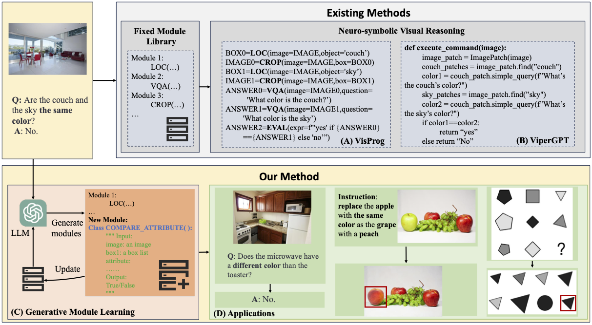

# GENOME: Generative Neuro-Symbolic Visual Reasoning by Growing and Reusing Modules

[ [Project Page](https://vis-www.cs.umass.edu/genome/) | [Arxiv Paper](https://arxiv.org/abs/2311.04901) ]



This repository contains the official code for GNSVR: Generative Neuro-Symbolic Visual Reasoning by Growing and Reusing Modules

# Install Dependencies
Firstly, install dependencies of [ViperGPT](https://github.com/cvlab-columbia/viper).

Then:
```
pip install -r requirements.txt
```

## OpenAI key

To run the OpenAI models, you will need to configure an OpenAI key. This can be done by signing up for an account [e.g. here](https://platform.openai.com/), and then creating a key in [account/api-keys](https://platform.openai.com/account/api-keys).
**Create a file `api.key` and store the key in it.**

# Running the code
## GQA
<details>
        <summary><b>Inference</b></summary>
        <p><b>scripts/gqa/gqa_stage3.sh</b></p>
        <pre>
python main.py \
    --model text-davinci-003 \
    --dataset imgedit \
    --test_num 50 \
    --stage 3 \
    --inference_prompt_path prompts/imgedit/imgedit_stage3.prompt \
    --dataset_dir dataset/imgedit \
    --ann_path imgedit_ann.json \
    --image_path imgedit_images/ \
    --save_output \
    --output_dir save/results/imgedit/imgedit_stage3/ \
    --use_new_module \
    --threshold 0.1 \
    --module_save_dir transfer/transfer_gqa_modules/ \
        </pre>
</details>

## RefCOCO
<details>
        <summary><b>Inference</b></summary>
        <p><b>scripts/refcoco/refcoco_stage3.sh</b></p>
        <pre>
python main.py \
    --model gpt-3.5-turbo-instruct \
    --dataset refcoco \
    --coco_dir /path/to/coco/ \
    --test_num 100 \
	--stage 3 \
    --inference_prompt_path prompts/refcoco/refcoco_stage3.prompt \
    --dataset_dir /path/to/refcoco/ \
    --save_output \
    --output_dir save/results/refcoco/refcoco_stage3/
        </pre>
</details>

## Knowledge-based Object Tagging
<details>
        <summary><b>Inference</b></summary>
        <p><b>scripts/okdet/okdet_stage3.sh</b></p>
        <pre>
python main.py \
    --model text-davinci-003 \
    --dataset okdet \
    --test_num 50 \
    --stage 3 \
    --inference_prompt_path prompts/okdet/okdet_stage3.prompt \
    --dataset_dir dataset/okdet \
    --ann_path okdet_ann.json \
    --image_path okdet_images/ \
    --save_output \
    --output_dir save/results/okdet/okdet_stage3/ \
    --use_new_module \
    --threshold 0.1 \
    --module_save_dir transfer/transfer_gqa_modules/ \
        </pre>
</details>

## Image Editing
<details>
        <summary><b>Inference</b></summary>
        <p><b>scripts/imgedit/imgedit_stage3.sh</b></p>
        <pre>
python main.py \
    --model text-davinci-003 \
    --dataset imgedit \
    --test_num 50 \
    --stage 3 \
    --inference_prompt_path prompts/imgedit/imgedit_stage3.prompt \
    --dataset_dir dataset/imgedit \
    --ann_path imgedit_ann.json \
    --image_path imgedit_images/ \
    --save_output \
    --output_dir save/results/imgedit/imgedit_stage3/ \
    --use_new_module \
    --threshold 0.1 \
    --module_save_dir transfer/transfer_gqa_modules/ \
        </pre>
</details>

## More tasks will be added soon.


# Citation
If you use this work or find it helpful, please consider citing: (bibtex)
```
@inproceedings{gnsvr2023,
         author = {Chen, Zhenfang and Sun, Rui and Liu, Wenjun and Hong, Yining and Gan, Chuang},
         title = {GENOME: Generative Neuro-Symbolic Visual Reasoning by Growing and Reusing Modules},
         journal = {arXiv},
         year = {2023},
        } 
```
